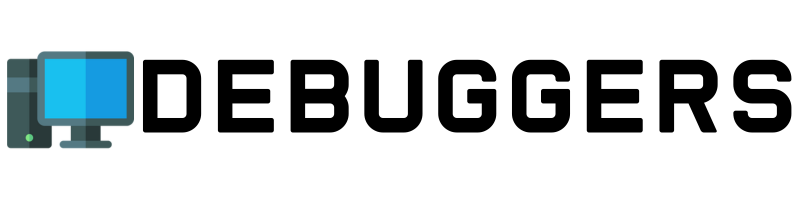

    

# Índice

- [Objetivo do Projeto](#objetivo-do-produto)
- [Vídeos e Apresentações](#vídeos-e-apresentações)
- [Backlog do Produto](#backlog-do-produto)
- [Backlog da Sprint](#backlog-da-sprint)
- [Autores](#autores)

# Objetivo do Projeto

Oferecer aos eleitores dados claros e acessíveis que ajudem a tomar decisões informadas nas eleições municipais
que se aproximam. A plataforma permitirá que os cidadãos visualizem a atuação dos vereadores, incluindo:

1. Presença nas Sessões: Percentual de presença e faltas, justificadas ou não.
2. Proposições Apresentadas: Projetos de lei, requerimentos e moções que o vereador apresentou
durante o mandato.
3. Projetos de Lei Aprovados: Detalhamento das propostas aprovadas, com links para o conteúdo
completo.
4. Posicionamento em Votações: Como o vereador votou em questões-chave.
5. Participação em Comissões: Informações sobre o envolvimento do vereador em comissões
especiais e permanentes

# Vídeos e Apresentações
## Sprint 1

[Apresentação]()

## Tecnologias

  <table>
  <tr>
    <td align="center" width="96">
      
      HTML
    </td>
    <td align="center" width="96">
      
      CSS
    </td>
    <td align="center" width="96">
      
      Figma
    </td>
    <td align="center" width="96">
      
      Python
     </td>
    <td align="center" width="96">
      
      JavaScript
    </td>
      <td align="center" width="96">
      
      MySQL
      </td>
    <td align="center" width="96">
      
      Flask
    </td>
  </tr>
</table>

# Backlog do produto

<table style="width: 100%; border-collapse: collapse;">
    <thead>
        <tr>
            <th style="border: 1px solid #ddd;">Requisito</th>
            <th style="border: 1px solid #ddd;">User Story</th>
            <th style="border: 1px solid #ddd;">Prioridade</th>
            <th style="border: 1px solid #ddd;">Estimativa</th>
        </tr>
    </thead>
    <tbody>
        <tr>
            <td style="border: 1px solid #ddd;">Presença nas Sessões</td>
            <td style="border: 1px solid #ddd;">Eu, como cidadão, gostaria de visualizar o percentual de presença de cada vereador nas sessões da Câmara e, caso existam faltas, se estas foram justificadas e qual foi a justificativa.</td>
            <td style="border: 1px solid #ddd;">Baixa</td>
            <td style="border: 1px solid #ddd;">3</td>
        </tr>
        <tr>
            <td style="border: 1px solid #ddd;">Proposições apresentadas</td>
            <td style="border: 1px solid #ddd;">Eu, como cidadão, gostaria de visualizar os Projetos de Lei, requerimentos e moções que cada vereador apresentou durante o seu mandato.</td>
            <td style="border: 1px solid #ddd;">Média</td>
            <td style="border: 1px solid #ddd;">5</td>
        </tr>
        <tr>
            <td style="border: 1px solid #ddd;">Projetos de Lei aprovados</td>
            <td style="border: 1px solid #ddd;">Eu, como cidadão, gostaria de visualizar os Projetos de Lei aprovados de cada vereador e o detalhamento das propostas aprovadas, com acesso ao conteúdo completo.</td>
            <td style="border: 1px solid #ddd;">Baixa</td>
            <td style="border: 1px solid #ddd;">5</td>
        </tr>
        <tr>
            <td style="border: 1px solid #ddd;">Posicionamento em votações</td>
            <td style="border: 1px solid #ddd;">Eu, como cidadão, gostaria de visualizar o posicionamento de cada vereador nas votações de questões-chave para o município.</td>
            <td style="border: 1px solid #ddd;">Baixa</td>
            <td style="border: 1px solid #ddd;">3</td>
        </tr>
        <tr>
            <td style="border: 1px solid #ddd;">Participação em Comissões</td>
            <td style="border: 1px solid #ddd;">Eu, como cidadão, gostaria de visualizar a participação de cada vereador nas comissões, com destaque para a forma como cada um se manifestou nas comissões especiais e permanentes.</td>
            <td style="border: 1px solid #ddd;">Média</td>
            <td style="border: 1px solid #ddd;">3</td>
        </tr>
        <tr>
            <td style="border: 1px solid #ddd;">Perfil individual de cada vereador</td>
            <td style="border: 1px solid #ddd;">Eu, como cidadão, gostaria de visualizar o perfil individual de cada vereador, sendo que neste perfil deverá conter: dados biográficos, histórico político, presença nas sessões, proposições apresentadas, Projetos de Lei aprovados, posicionamento em votações, participação em comissões.</td>
            <td style="border: 1px solid #ddd;">Alta</td>
            <td style="border: 1px solid #ddd;">8</td>
        </tr>
        <tr>
            <td style="border: 1px solid #ddd;">Ferramenta de busca e filtros</td>
            <td style="border: 1px solid #ddd;">Eu, como cidadão, gostaria de um recurso que permitisse buscar o perfil de cada vereador por nome, partido e atuação em temas específicos.</td>
            <td style="border: 1px solid #ddd;">Alta</td>
            <td style="border: 1px solid #ddd;">3</td>
        </tr>
        <tr>
            <td style="border: 1px solid #ddd;">Informação sobre reeleição de vereadores</td>
            <td style="border: 1px solid #ddd;">Eu, como cidadão, gostaria de saber quais vereadores estão se reelegendo.</td>
            <td style="border: 1px solid #ddd;">Média</td>
            <td style="border: 1px solid #ddd;">1</td>
        </tr>
        <tr>
            <td style="border: 1px solid #ddd;">Painel de estatísticas</td>
            <td style="border: 1px solid #ddd;">Eu, como cidadão, gostaria de visualizar um painel de estatísticas contendo a atuação geral de cada vereador na Câmara, comparando o desempenho entre eles.</td>
            <td style="border: 1px solid #ddd;">Média</td>
            <td style="border: 1px solid #ddd;">5</td>
        </tr>
        <tr>
            <td style="border: 1px solid #ddd;">Feedback do eleitorado</td>
            <td style="border: 1px solid #ddd;">Eu, como cidadão, gostaria de visualizar comentários relevantes do eleitorado sobre cada vereador, assim como a classificação atribuída a cada um deles.</td>
            <td style="border: 1px solid #ddd;">Baixa</td>
            <td style="border: 1px solid #ddd;">3</td>
        </tr>
        <tr>
            <td style="border: 1px solid #ddd;">Lista completa de todos os vereadores atuais</td>
            <td style="border: 1px solid #ddd;">Eu, como cidadão, gostaria de visualizar uma lista completa de todos os vereadores em atuação.</td>
            <td style="border: 1px solid #ddd;">Alta</td>
            <td style="border: 1px solid #ddd;">1</td>
        </tr>
    </tbody>
</table>

# Backlog da Sprint

## Sprint 1

- Criar repositório no GitHub
- Padronizar pastas do GitHub
- Backlog do Produto
- Validação do Backlog do Produto
- Criação do Jira
- Criar wireframes
- Validar wireframes
- Raspagem de dados - Estudo
- Raspagem de dados
- Modelagem do banco de dados
- Script do banco de dados
- Página Home
- Página Informativa
- Página Comparação
- Modal

# Autores

|    Função     | Nome        |                                                                                                                                                    LinkedIn & GitHub                                                                                                                                                    |
| :-----------: | :---------- | :---------------------------------------------------------------------------------------------------------------------------------------------------------------------------------------------------------------------------------------------------------------------------------------------------------------------: |
| Product Owner | Lucas Martins |                 |
| Scrum Master  | Matheus Karnas   |         |
|  Team Member  | Marcos Yudi    |         |
|  Team Member  | Julia Rosa    |                |
|  Team Member  | Victor Chagas   |   |
|  Team Member  | Lucas Araujo   |                    |
|  Team Member  | Gabriel Robert   |                    |
|  Team Member  | Pedro Rosa   |   |
